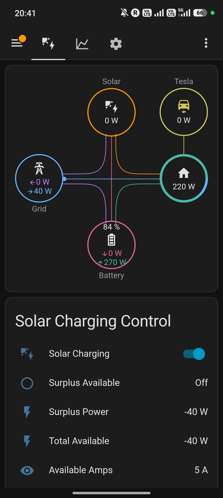
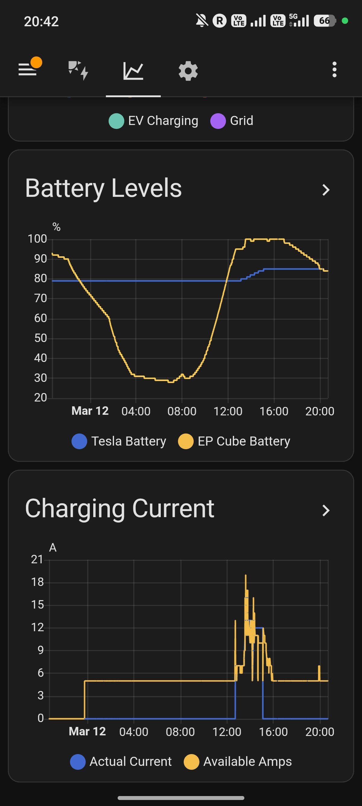
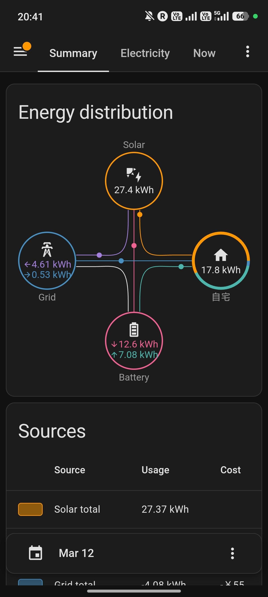
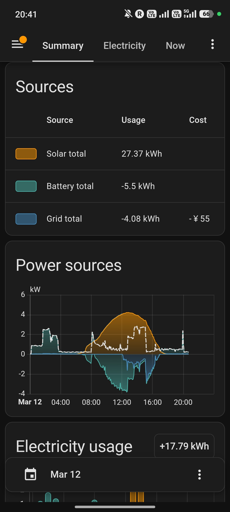
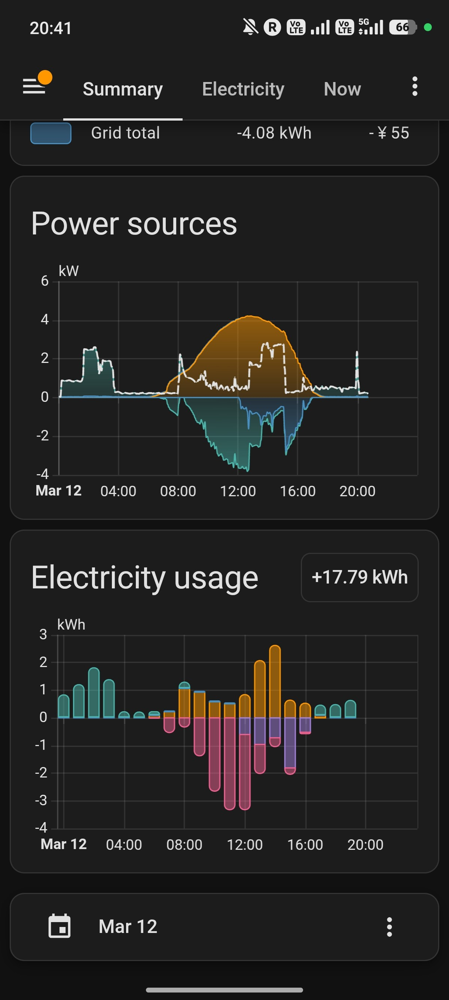
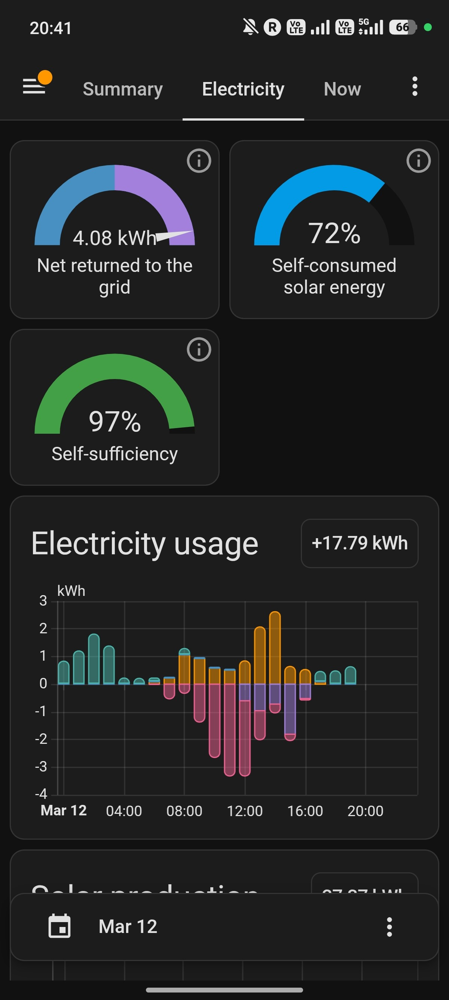
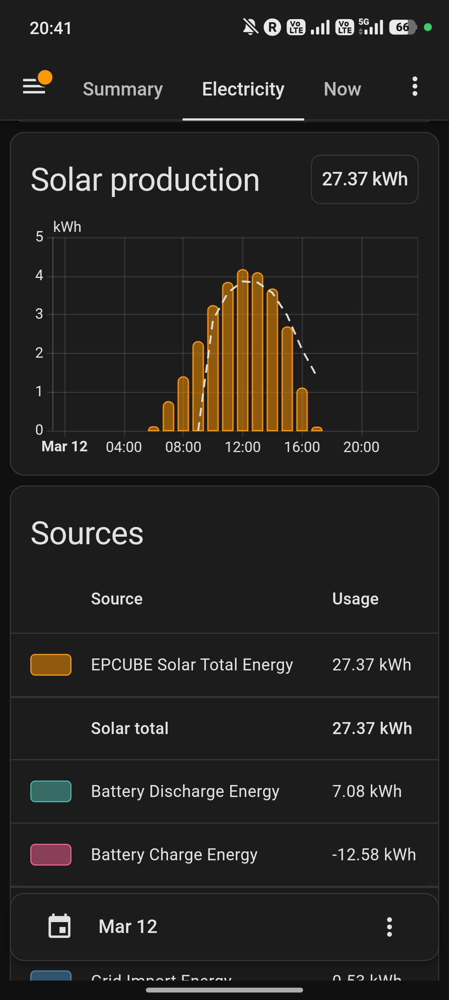
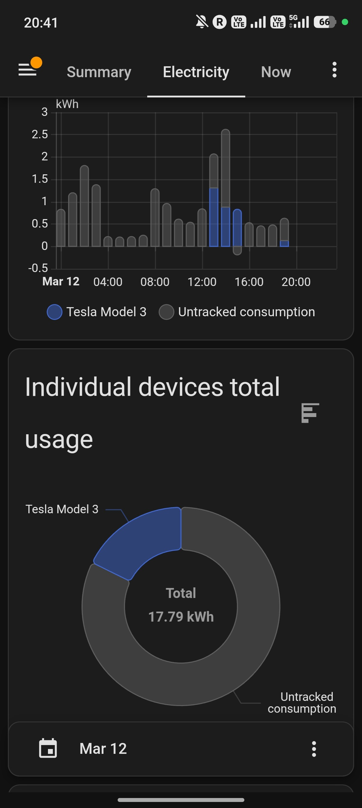

# EV ダッシュボード操作ガイド

EVダッシュボードは3つのビュー (タブ) で構成されている。
サイドバーでは `mdi:car-electric` アイコンで「EV」と表示される。

```
URL: http://<NAS_IP>:8123/solar-ev-charging/overview
```

---

## Overview (メインビュー)

日常的に確認・操作するメイン画面。メインエリアとサイドバーで構成される。



### Power Flow Card (power-flow-card-plus)

リアルタイムの電力フロー図。Solar、Grid、Battery、Home、Teslaの5つの要素間の電力の流れをアニメーション付きで表示する。

| 要素 | エンティティ | 説明 |
|------|-------------|------|
| **Solar** | `sensor.ep_cube_measured_instantaneous_amount_of_electricity_generated` | 太陽光発電 (W) |
| **Grid** | `sensor.smart_meter_power` | 系統電力 (W)。青=買電、紫=売電 |
| **Battery** | `sensor.ep_cube_battery_power_display` | 蓄電池充放電 (W)。SOC%も表示 |
| **Home** | `sensor.home_consumption_power` | 家庭消費 (W) |
| **Tesla** | `sensor.tesla_charging_power_w` | Tesla充電電力 (W)。バッテリー残量%も表示 |

**前提条件:** HACS > Frontend から `power-flow-card-plus` をインストールしておく必要がある。

### Energy Flow Card (energy-flow-card-plus)

日別の累積エネルギーフロー (kWh)。Energy Dashboard と同じデータを使用。

| 要素 | エンティティ | 説明 |
|------|-------------|------|
| **Solar** | `sensor.ep_cube_measured_cumulative_amount_of_electric_energy_generated` | 累積発電量 |
| **Grid (buy)** | `sensor.smart_meter_cumulative_buy` | 累積買電量 |
| **Grid (sell)** | `sensor.smart_meter_cumulative_sell` | 累積売電量 |
| **Battery (discharge)** | `sensor.ep_cube_ac_measured_cumulative_discharging_electric_energy` | 累積放電量 |
| **Battery (charge)** | `sensor.ep_cube_ac_measured_cumulative_charging_electric_energy` | 累積充電量 |
| **Tesla** | `sensor.tesla_ev_charging_energy` | EV充電エネルギー |

**前提条件:** HACS > Frontend から `energy-flow-card-plus` をインストールしておく必要がある。

### Solar Charging Control カード (サイドバー)

余剰充電の自動制御に関する状態表示と切り替え。

| 項目 | 説明 | 操作 |
|------|------|------|
| **Solar Charging** | 余剰充電の自動制御ON/OFF | トグルスイッチで切替 |
| **Surplus Available** | 充電条件が全て成立しているか | 表示のみ (自動計算) |
| **Surplus Power** | 現在の余剰電力 (W) | 表示のみ (自動計算) |
| **Total Available** | 余剰 + 充電中電力 (W) | 表示のみ (自動計算) |
| **Available Amps** | 余剰から計算した充電可能電流 (A) | 表示のみ (自動計算) |

**Solar Charging トグルの動作:**
- **ON**: 自動化ルールが30秒ごとに余剰電力をチェックし、条件を満たせば自動で充電を開始/停止/電流調整する
- **OFF**: 自動化を停止し、充電中であれば充電も停止する

**Surplus Available が ON になる条件** (全て満たす必要あり):
1. 余剰電力 >= 1200W
2. 充電フラップが開いている (プラグ接続済み)
3. バッテリー残量 < 充電上限

**Surplus Power の読み方:**
- 正の値 (例: 2000W) → 売電中。余剰があり充電に使える
- 負の値 (例: -40W) → 買電中。太陽光が不足している
- 計算式: `smart_meter_power × -1`

**Total Available の読み方:**
- `Surplus Power + Tesla充電電力 (W)`
- 充電中でも「もし充電を止めたら余剰はいくらか」を表す

**Available Amps の読み方:**
- `(Total Available - 400W) ÷ 200V` を5-24Aの範囲にクランプ
- 例: Total Available 2400W → (2400-400)/200 = 10A

### Tesla Model 3 カード (サイドバー)

車両の充電状態と制御。Tesla Model 3カード内でCharging Switchの操作も可能。

| 項目 | 説明 | 操作 |
|------|------|------|
| **Battery Level** | バッテリー残量 (%) | 表示のみ |
| **Charging State** | 充電状態テキスト | 表示のみ |
| **Plugged In** | 充電フラップの開閉 | 表示のみ |
| **Charging Current (A)** | 実際の充電電流 | 表示のみ (充電停止時は0) |
| **Charging Power (kW)** | 実際の充電電力 | 表示のみ |
| **Set Charging Amps** | 充電電流の設定値 | スライダーで手動変更可能 |
| **Charge Limit** | 充電上限の設定値 (%) | スライダーで手動変更可能 |
| **Charging Switch** | 充電のON/OFF | トグルスイッチで手動切替 |

**Charging State の値:**
| 状態 | 意味 |
|------|------|
| Stopped | 充電停止中 (プラグは接続されている場合あり) |
| Charging | 充電中 |
| Complete | 充電上限まで充電完了 |
| Disconnected | プラグ未接続 |
| NoPower | Wall Connector側に電力供給なし |

**Charging Current について:**
- `sensor.tesla_actual_charging_current` テンプレートセンサーを使用
- 充電中 → Tesla BLEから取得した実際の電流値
- 充電停止中 → 0A と表示
- (Tesla BLEの生データ `sensor.tesla_ble_charge_current` は停止後も最後の値を保持する仕様のため)

**手動操作のヒント:**
- Solar Charging を OFF にしてから手動で Charging Switch を操作すると、自動制御に邪魔されない
- Set Charging Amps を変更すると、次に充電開始する際にその電流で充電される
- 自動制御ON時は、Set Charging Amps は30秒ごとに余剰に合わせて自動調整される

---

## History (履歴ビュー)

過去24時間のグラフ表示。充電の効果確認や太陽光パターンの把握に使用。



### Power Flow (Today) グラフ

5つの電力値を時系列で表示。

| ライン | エンティティ | 説明 |
|--------|-------------|------|
| **Solar** | `sensor.ep_cube_measured_instantaneous_amount_of_electricity_generated` | 太陽光発電量 (W) |
| **Surplus** | `sensor.solar_surplus_power` | 余剰電力 (W)。正=売電/余剰、負=買電 |
| **Total Available** | `sensor.solar_total_available_power` | 余剰+充電中電力 (W) |
| **EV Charging** | `sensor.tesla_charging_power_w` | Tesla充電電力 (W) |
| **Grid** | `sensor.smart_meter_power` | 系統電力 (W)。正=買電、負=売電 |

**グラフの見方:**
- Solarが立ち上がる時間帯 → 太陽光発電開始
- SurplusがEV Chargingに追従 → 余剰充電が正常動作
- Surplusが負の時間帯 → 買電中 (夜間や曇天)

### Battery Levels グラフ

Teslaと EP Cube のバッテリー残量推移。

| ライン | エンティティ | 説明 |
|--------|-------------|------|
| **Tesla Battery** | `sensor.tesla_ble_charge_level` | Tesla車両のバッテリー残量 (%) |
| **EP Cube Battery** | `sensor.ep_cube_remaining_stored_electricity_3` | EP Cube蓄電池の残量 (%) |

**グラフの見方:**
- Tesla Batteryが階段状に増加 → 充電が断続的に行われている
- EP Cubeが日中に上がり夜間に下がる → 正常な蓄放電サイクル

### Charging Current グラフ

充電電流の推移。

| ライン | エンティティ | 説明 |
|--------|-------------|------|
| **Actual Current** | `sensor.tesla_actual_charging_current` | 実際にTeslaに流れた電流 (A) |
| **Available Amps** | `sensor.available_charging_amps` | 余剰から計算した利用可能電流 (A) |

**グラフの見方:**
- Available AmpsとActual Currentが近い値 → 余剰を効率よく使えている
- Available Ampsが高いのにActual Currentが0 → 充電が停止状態 (条件未達)

### Device Energy グラフ

Energy Dashboard のデバイス別消費を表示。

---

## System (システムビュー)

ESP32の診断情報、タイマー状態、自動化ルールの管理。

### ESP32 Diagnostics カード

| 項目 | 説明 | 正常値の目安 |
|------|------|-------------|
| **WiFi Signal** | ESP32のWiFi信号強度 (dBm) | -30〜-70 dBm |
| **Uptime** | ESP32の起動からの経過時間 (秒) | 増加し続ける |
| **Vehicle Asleep** | 車両がスリープ中か | off=起きている |
| **User Present** | ユーザーが車両近くにいるか | on/off |
| **BLE Signal** | ESP32とTesla間のBLE信号強度 (dBm) | -30〜-70 dBm |
| **IP Address** | ESP32のIPアドレス | 192.168.x.x |

**信号強度の目安:**
| 範囲 | 状態 |
|------|------|
| -30〜-50 dBm | 非常に良好 |
| -50〜-70 dBm | 良好 |
| -70〜-80 dBm | やや弱い (接続不安定の可能性) |
| -80 dBm 以下 | 弱い (ESP32の設置場所を見直す) |

### Charging Timers カード

| 項目 | 説明 | デフォルト |
|------|------|-----------|
| **Enable Delay** | 充電開始遅延 | 1分 |
| **Disable Delay** | 充電停止遅延 | 3分 |
| **Guard** | ON/OFF 切替ガード | 5分 |
| **Stabilize** | 電流変更後安定化待ち | 90秒 |

### Automations カード

自動化ルールの一覧と有効/無効切替。

| 自動化 | 説明 | トリガー |
|--------|------|----------|
| **Adjust Charging Amps** | メインの制御ループ | 30秒ごと |
| **Start Charging (Enable Delay Expired)** | 遅延後の充電開始 | enable delay 満了 |
| **Stop Charging (Disable Delay Expired)** | 遅延後の充電停止 | disable delay 満了 |
| **Stop on Low Solar Production** | 低ソーラー時の停止 | solarpower < 800W が 3分継続 |
| **Stop on Grid Import** | 買電超過時の緊急停止 | surplus < -500W が 2分継続 |
| **Charging Complete** | 充電完了通知 | 充電状態が "Complete" に変化 |
| **Manual Disable** | 手動OFF時に充電停止 | Solar Charging を OFF |
| **Cable Plugged Guard** | ケーブル接続時の自動OFF | charger ON 検出 + Solar ON + guard idle |

各自動化はトグルスイッチで個別に有効/無効を切り替えられる。
通常は全てONのままにしておく。

---

## よくある操作シナリオ

### 日常運用 (自動)
1. 朝、Solar Charging が ON になっていることを確認 (通常は常時ON)
2. 車に充電プラグを接続
3. あとは自動: 太陽光余剰が出たら充電開始、なくなったら停止

### 手動で充電を強制開始/停止
1. Solar Charging を **OFF** にする (自動制御を無効化)
2. Charging Switch を手動で ON/OFF
3. 必要に応じて Set Charging Amps で電流を調整
4. 終わったら Solar Charging を **ON** に戻す

### 外出前に急いで充電
1. Solar Charging を **OFF** にする
2. Set Charging Amps を **24A** (最大) に設定
3. Charging Switch を **ON**
4. 必要な残量になったら停止、Solar Charging を **ON** に戻す

### 充電上限を変更
1. Charge Limit スライダーを調整 (例: 80% → 90%)
2. 自動制御は新しい上限を自動的に参照する

### ESP32/BLEの接続が不安定な時
1. System ビューで WiFi Signal と BLE Signal を確認
2. Vehicle Asleep が ON の場合、Developer Tools > Services で `button.press` → `button.tesla_ble_wake_up` で起こす
3. それでも改善しない場合、ESPHome Dashboard から ESP32 を再起動

---

## 参考: Home Assistant エネルギーダッシュボード

Home Assistant 標準のエネルギーダッシュボードでは、太陽光発電・蓄電池・系統電力・EV充電の全体像を日単位で確認できる。

### Energy Distribution (エネルギー分配)

Solar、Grid、Battery、Home の間のエネルギーフロー (kWh) を視覚化。



### Sources & Power Sources (電力ソース)

ソース別の発電・消費量サマリーと、時系列の電力推移グラフ。




### Electricity タブ (自給率・自家消費率)

系統への売電量、太陽光の自家消費率、自給率をゲージで表示。



### Solar Production (太陽光発電量)

時間帯別の太陽光発電量とソース別エネルギー内訳。



### Device Usage (デバイス別消費)

Tesla Model 3 の充電消費を含むデバイス別の電力消費内訳。


