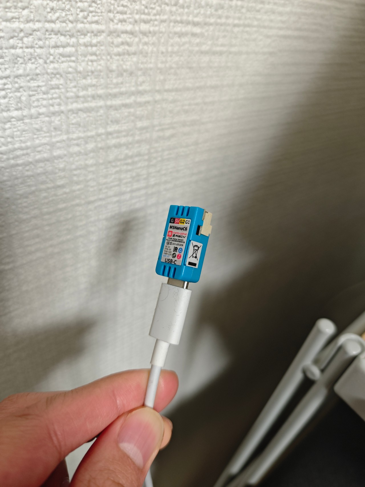

# ESPHome Tesla BLE

M5Stack NanoC6 (ESP32-C6) で Tesla Model 3 を BLE 制御する ESPHome ファームウェア。
[PedroKTFC/esphome-tesla-ble](https://github.com/PedroKTFC/esphome-tesla-ble) をベースにしている。



## ハードウェア

| 部品 | 価格 |
|------|------|
| M5Stack NanoC6 (ESP32-C6) | ~¥2,000 |
| USB-C 電源 (5V) | ~¥500 |

## セットアップ

### 1. secrets.yaml を編集

```yaml
wifi_ssid: "your_wifi"
wifi_password: "your_password"
tesla_vin: "5YJ3E..."
tesla_ble_mac: "AA:BB:CC:DD:EE:FF"  # Step 4 で取得
api_encryption_key: "generate_me"     # 下記コマンドで生成
ota_password: "your_ota_password"
```

### 2. API 暗号化キーの生成

```bash
python3 -c "import secrets, base64; print(base64.b64encode(secrets.token_bytes(32)).decode())"
```

### 3. 初回フラッシュ (USB 接続)

- M5Stack NanoC6 を PC に USB-C 接続
- Web ESPHome: https://web.esphome.io でブラウザからフラッシュ
- または ESPHome Dashboard > New Device > `tesla-ble.yaml` の内容を貼り付け

### 4. BLE MAC アドレスの検出

1. `tesla-ble.yaml` の `tesla_ble_listener:` セクションのコメントを外す
2. ESPHome でファームウェアをビルド・フラッシュ (OTA)
3. ESPHome のログで Tesla の BLE MAC アドレスを確認
4. `secrets.yaml` に記入し、`tesla_ble_listener:` を再度コメントアウト
5. 再度ビルド・フラッシュ

### 5. 設置

充電器/車の近く (BLE 範囲 10m 以内) に USB-C 電源で設置。

### 6. HA に統合を追加

1. Settings > Devices & Services > Add Integration > ESPHome
2. NanoC6 の IP アドレスを入力
3. API 暗号化キーを入力

### 7. BLE ペアリング

1. HA のデバイス画面で「Pair BLE Key」ボタンを押す
2. **重要**: Tesla 車のドアを開けた状態で行う
3. Tesla 車内のタッチスクリーンで BLE キーを承認

### 8. 動作確認 (Developer Tools > States)

- `sensor.tesla_ble_charge_level` → バッテリー残量%
- `sensor.tesla_ble_charging_state` → 充電状態
- `binary_sensor.tesla_ble_charge_flap` → 充電フラップ開閉
- `switch.tesla_ble_charger` → 充電 ON/OFF

## クロスサブネット接続

NAS と NanoC6 が別サブネットの場合、WiFi ルーターのポートマッピングで中継する。

```
Synology NAS (192.168.0.3)       WiFi Router (192.168.0.2)       NanoC6 (192.168.1.156)
  192.168.0.x/24           -->     6053/TCP --> 192.168.1.156:6053     192.168.1.x/24
```

### 設定手順

1. **WiFi ルーターでポートマッピングを設定**:
   - 外部ポート: `6053` (TCP)
   - 転送先 IP: NanoC6 の IP アドレス
   - ESPHome API はポート 6053 を使用

2. **`tesla-ble.yaml` の `use_address` を設定**:
   ```yaml
   wifi:
     use_address: 192.168.0.2  # WiFi ルーターの IP
   ```

3. **HA の統合追加時**: NanoC6 のアドレスとしてルーター IP を入力

## エンティティ一覧

| Entity ID | 説明 | 値の例 |
|-----------|------|--------|
| `sensor.tesla_ble_charge_level` | バッテリー残量 % | 74.0 |
| `sensor.tesla_ble_charging_state` | 充電状態 | Stopped / Charging / Complete |
| `sensor.tesla_ble_charge_current` | 充電電流 A (※) | 4.0 |
| `sensor.tesla_ble_charge_voltage` | 充電電圧 V | 207.0 |
| `binary_sensor.tesla_ble_charge_flap` | 充電フラップ開閉 | on / off |
| `switch.tesla_ble_charger` | 充電 ON/OFF | on / off |
| `number.tesla_ble_charging_amps` | 充電電流設定 | 0-24 A |
| `number.tesla_ble_charging_limit` | 充電上限設定 | 50-100 % |

※ `sensor.tesla_ble_charge_current` は充電停止後も最後の値を保持する。
ダッシュボードでは `sensor.tesla_actual_charging_current` (テンプレートセンサー) を使用。
