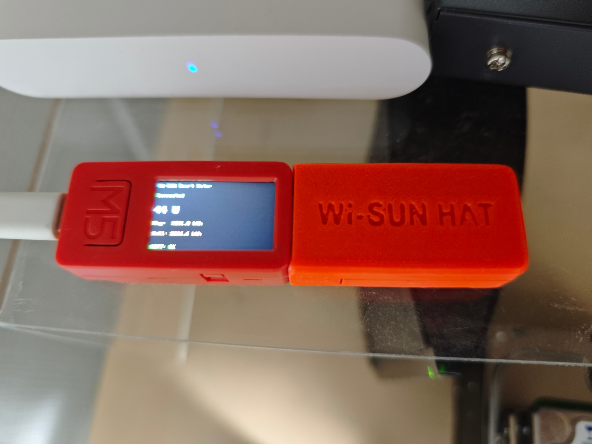

# Wi-SUN Smart Meter Reader

M5StickC Plus + BP35A1 (Wi-SUN HAT) を使って、TEPCO スマートメーターから電力データをローカルで取得し、MQTT で Home Assistant に送信するファームウェア。



## ハードウェア

[SmartMeterMonitor_M5Stack](https://github.com/yonmas/SmartMeterMonitor_M5Stack) を参考に構成。

| 部品 | 型番 | 購入先 | 価格 |
|---|---|---|---|
| マイコン | M5StickC Plus | [スイッチサイエンス](https://www.switch-science.com/) | ¥4,180 |
| Wi-SUN モジュール | ROHM BP35A1 | [チップワンストップ](https://www.chip1stop.com/) | ¥6,750 |
| 接続 HAT | Wi-SUN HAT | [スイッチサイエンス](https://www.switch-science.com/) | ¥1,650 |

### ピン接続 (Wi-SUN HAT)

| ESP32 GPIO | 方向 | BP35A1 |
|---|---|---|
| GPIO26 (RX) | ← | BP35A1 TX |
| GPIO0 (TX) | → | BP35A1 RX |

- UART: HardwareSerial(1), 115200 baud, 8N1

## 取得データ

| データ | ECHONET Lite EPC | 単位 | MQTT トピック |
|---|---|---|---|
| 瞬時電力 | 0xE7 | W | `smartmeter/power` |
| 積算買電量 | 0xE0 | kWh | `smartmeter/energy_buy` |
| 積算売電量 | 0xE3 | kWh | `smartmeter/energy_sell` |
| 接続状態 | — | — | `smartmeter/status` |

- 30秒ごとに E7 + E0 + E3 をマルチプロパティリクエスト (OPC=3) で一括取得
- 瞬時電力は ±30,000W の範囲フィルタリングあり（異常値除外）
- 積算電力量の係数は 0.1 kWh/unit
- 各プロパティは個別の valid フラグで管理（0.0 グリッチ防止）

## 通信方式

### ECHONET Lite リクエスト

- **マルチプロパティ方式**: 1フレームで E7 + E0 + E3 を一括リクエスト (OPC=3)
- リクエスト前に1秒の待機時間
- タイムアウト: 10秒/リクエスト
- ERXUDP 出力: ASCII モード (WOPT 01)

### ECHONET Lite フレーム構造

リクエスト (マルチプロパティ):
```
1081 0001 05FF01 028801 62 03 E700 E000 E300
│    │    │      │      │  │  │    │    └─── EPC=E3, PDC=0
│    │    │      │      │  │  │    └──────── EPC=E0, PDC=0
│    │    │      │      │  │  └───────────── EPC=E7, PDC=0
│    │    │      │      │  └──────────────── OPC (3: プロパティ数)
│    │    │      │      └─────────────────── ESV (62: Get)
│    │    │      └────────────────────────── DEOJ (028801: 低圧スマートメーター)
│    │    └───────────────────────────────── SEOJ (05FF01: コントローラ)
│    └────────────────────────────────────── TID (0001)
└─────────────────────────────────────────── EHD (1081: ECHONET Lite)
```

レスポンス (OPC=3):
```
1081 0001 028801 05FF01 72 03 E7 04 XXXXXXXX E0 04 XXXXXXXX E3 04 XXXXXXXX
                           │  │              │              └─── 売電量 (4byte)
                           │  │              └────────────────── 買電量 (4byte)
                           │  └───────────────────────────────── 瞬時電力 (4byte, signed)
                           └──────────────────────────────────── OPC=3
```

### MQTT

- ブローカー: Synology NAS 上の Mosquitto (ポート 1883)
- **Last Will and Testament (LWT)**: 切断時に `smartmeter/status` へ `offline` を自動送信
- 接続時に `smartmeter/status` へ `online` を送信 (retained)
- **Keepalive**: 60秒（ポーリング中のブロッキングによる切断防止）
- 各トピックは retained メッセージで送信

### セッション監視

- ポーリング失敗1回で即座に Wi-SUN セッションを再接続
- 再接続: SKTERM → メモリ上のキャッシュで PANA 認証（最大2回リトライ）
- スキャン不要のため約30秒で復帰（フルスキャン時は2〜3分）
- SKJOIN の FAIL ER05（前セッション未終了）を即検出し、120秒待ちを回避
- 2回とも認証失敗した場合のみキャッシュクリア → フルスキャンにフォールバック

## Wi-SUN 接続シーケンス

1. **SKRESET** — モジュールリセット
2. **SKSREG SFE 0** — エコーバック無効化
3. **ROPT / WOPT 01** — ERXUDP 出力を ASCII モードに設定
4. **SKTERM** — 前回セッションの終了
5. **SKSETPWD / SKSETRBID** — B ルート認証情報設定
6. **SKSCAN** — スマートメーター探索 (duration 4→7 で段階的に)
7. **SKSREG S2/S3** — チャンネル・PAN ID 設定
8. **SKLL64** — MAC → IPv6 リンクローカルアドレス変換
9. **SKJOIN** — PANA 認証開始
10. **EVENT 25** — 認証成功 → データ取得開始

### リトライ・キャッシュ

- スキャン結果は NVS (ESP32 フラッシュ) にキャッシュ
- **初回接続** (`connect`): 最大3回リトライ
  - 1回目: NVS キャッシュを使用 → PANA 認証、失敗時はキャッシュクリア
  - 2-3回目: 再スキャン → PANA 認証、失敗時はキャッシュクリア
  - リトライ間隔: 5秒
- **再接続** (`reconnect`): メモリ上のキャッシュで PANA 認証を最大2回リトライ
  - NVS 読み込み・スキャン不要のため高速復帰
  - 2回失敗した場合のみ `connect` にフォールバック
- スキャン duration は 4→5→6→7 と段階的に延長
- スキャンタイムアウト: duration 4 は 30秒、duration 5-7 は 90秒
- PANA 認証タイムアウト: 120秒

## ボタン操作

| ボタン | 位置 | 機能 |
|---|---|---|
| A | 正面 (M5) | デバッグ情報表示 (5秒間) |
| B | 側面 | スキャンキャッシュクリア & 再起動 |

## LCD 表示

### 起動画面

接続完了までのステータスログを表示:
```
Wi-SUN Smart Meter
Initializing...
WiFi connecting...
WiFi OK: 192.168.0.x
MQTT connected
Modem reset...
Scanning...
Meter found!
Authenticating...
Authenticated!
Wi-SUN READY!
```

### ステータス画面 (通常)

```
Wi-SUN Smart Meter      🔋 75%
Connected              (緑) / Connecting... (赤)

123 W                  瞬時電力

Buy:  1200.8 kWh       積算買電量
Sell:  456.3 kWh       積算売電量

MQTT: OK (緑) / Disconnected (赤)
```

- 右上にバッテリーアイコンとパーセンテージを常時表示
- バッテリー色: 緑(>50%) / 黄(>20%) / 赤(≤20%)
- 再接続中はステータス行に「Reconnecting...」を表示（画面遷移なし）

## 設定ファイル

| ファイル | 内容 |
|---|---|
| `src/config.h` | MQTT サーバー、トピック、ピン設定、更新間隔 |
| `src/secrets.h` | WiFi / MQTT / B ルート認証情報 (gitignore 対象) |
| `src/secrets.example.h` | secrets.h のテンプレート |

### 主要パラメータ (config.h)

| パラメータ | デフォルト | 説明 |
|---|---|---|
| `MQTT_SERVER` | 192.168.0.3 | MQTT ブローカー IP |
| `MQTT_PORT` | 1883 | MQTT ポート |
| `POLL_INTERVAL` | 30000 (30秒) | 全データ取得間隔 |
| `MQTT_RECONNECT_INTERVAL` | 5000 (5秒) | MQTT 再接続間隔 |
| `BP35A1_BAUD` | 115200 | BP35A1 ボーレート |

## ビルド & フラッシュ

```bash
make test           # ネイティブユニットテスト
make build          # ビルド
make flash          # フラッシュ
make monitor        # シリアルモニター
make monitor-log    # タイムスタンプ付きログをファイルに出力
make flash-monitor  # フラッシュ + モニター
```

## Home Assistant 側の設定

### 1. Mosquitto MQTT ブローカー

Docker Compose で Mosquitto を起動（[docker/docker-compose.yaml](../docker/docker-compose.yaml) 参照）。

### 2. MQTT インテグレーション追加

Settings > Devices & Services > Add Integration > **MQTT**
- ブローカー: `localhost`（HA と同じ Docker ネットワーク内）
- ポート: `1883`

### 3. MQTT センサー定義

[homeassistant/configuration.yaml](../homeassistant/configuration.yaml) の `mqtt:` セクションで定義済み:

```yaml
mqtt:
  sensor:
    - name: "Smart Meter Power"
      state_topic: "smartmeter/power"
      unit_of_measurement: "W"
      device_class: power
      state_class: measurement

    - name: "Smart Meter Cumulative Buy"
      state_topic: "smartmeter/energy_buy"
      unit_of_measurement: "kWh"
      device_class: energy
      state_class: total_increasing

    - name: "Smart Meter Cumulative Sell"
      state_topic: "smartmeter/energy_sell"
      unit_of_measurement: "kWh"
      device_class: energy
      state_class: total_increasing

  binary_sensor:
    - name: "Smart Meter Online"
      state_topic: "smartmeter/status"
      payload_on: "online"
      payload_off: "offline"
      device_class: connectivity
```

設定反映後、HA を再起動すると以下のエンティティが使用可能になる:

| Entity ID | 説明 |
|---|---|
| `sensor.smart_meter_power` | 瞬時電力 W（正=買電, 負=売電） |
| `sensor.smart_meter_cumulative_buy` | 累積買電量 kWh |
| `sensor.smart_meter_cumulative_sell` | 累積売電量 kWh |
| `binary_sensor.smart_meter_online` | デバイス接続状態（LWT による自動検出） |

詳細は [homeassistant/README.md](../homeassistant/README.md) を参照。

## 依存ライブラリ

| ライブラリ | バージョン | 用途 |
|---|---|---|
| M5StickCPlus | ^0.1.0 | LCD・ボタン・IMU |
| PubSubClient | ^2.8 | MQTT クライアント |
| ArduinoJson | ^7.0.0 | (将来の拡張用) |
